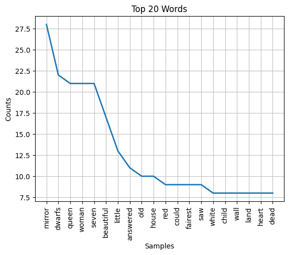
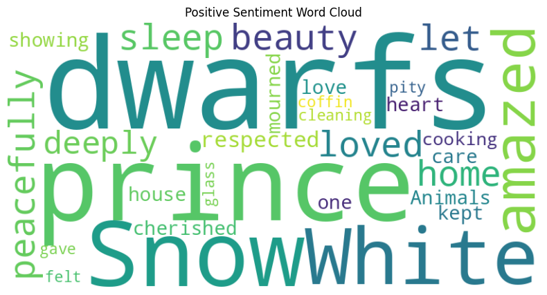

# 📚 Sentiment Analysis with NLP: Snow White Case Study

This project applies **Natural Language Processing (NLP)** techniques to analyze the sentiment of text from the classic fairytale _Snow White_. Through preprocessing, vectorization, and classification, it demonstrates how to extract emotional patterns from narrative data using a hands-on, end-to-end pipeline.

[📁 View the Notebook](notebooks/NLP_Sentiment_Analysis_SnowWhite.ipynb)

---

## 🎯 Project Highlights

- **Manual Annotation**: 10 narrative paragraphs were manually labeled as positive or negative to provide ground truth.
- **End-to-End Pipeline**:
  - Preprocessing: tokenization, stopword removal, lemmatization
  - Feature Engineering: TF-IDF vectorization
  - Modeling: Naive Bayes classification
  - Visualization: word frequency and sentiment word clouds

---

## 🖼 Visual Examples

### 🔢 Word Frequency Distribution  

### 😊 Positive Sentiment Word Cloud  

### 😠 Negative Sentiment Word Cloud  

---

## 🧰 Technologies Used

- Python (Jupyter / Colab / VSCode)
- NLTK, scikit-learn, pandas, NumPy
- Matplotlib & WordCloud for visualization

---

## 📂 Project Structure

- `/data/` – Contains `snow_white.txt`, the raw text used for analysis
- `/assets/` – Sentiment-based word cloud images
- `/notebooks/` – Main analysis in `.ipynb` format
- `README.md` – Project overview (this file)

---

## 🧠 Key Insights

- Words like _dwarfs_, _prince_, _love_ dominate positive sentiment
- Negative paragraphs are driven by terms like _jealous_, _poisoned_, _wicked_
- Simple manual labels and a small sample can still enable meaningful sentiment classification

---

## 🙋‍♂️ About Me

I'm a Master’s student in Analytics with a focus on real-world applications of NLP and data visualization. My academic and personal projects combine business logic with technical execution across Tableau, Looker, Python, and SQL.

---

## 📬 Contact

Feel free to connect on [LinkedIn](https://www.linkedin.com/in/allen-lei-zhao/) or reach out via email: `allen.lei.zhao@gmail.com`
